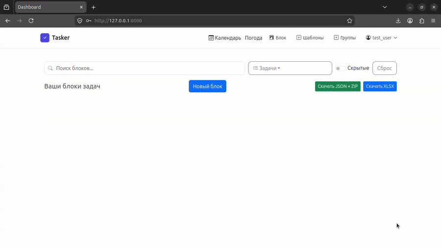

# 🚀 Simple Todo Planner

> Plan your day like a system — not just a list.

Simple Todo Planner — это продвинутое веб-приложение для управления задачами, разработанное на Django.  
В отличие от классических todo-листов, приложение использует **блочную архитектуру**, систему шаблонов и инструменты безопасности.

---

## 🎬 Demo (x8)


📸 Screenshots:

- 📅 Календарь задач  
- 🧱 Блоки и задачи  
- 🔒 PIN-защита  

_(добавь сюда скриншоты или GIF)_

---

## ⚡ Основные возможности

### 🧱 Блочная система задач
- Группировка задач в логические блоки
- Привязка к конкретной дате
- Удобное управление большим количеством задач

---

### 🔁 Шаблоны задач (Templates Engine)
- Пользовательские шаблоны
- Системные шаблоны
- Быстрое создание повторяющихся задач
- Автоматическая синхронизация

---

### 📅 Календарь
- Планирование по дням
- Быстрое переключение между датами
- Наглядная структура задач

---

### 🔒 Безопасность
- PIN-код для защиты доступа
- Скрытие задач
- Поддержка шифрования

---

### ⚙️ Интерактивный UI
- Динамическое обновление (AJAX / Fetch)
- Модальные окна и popover
- Работа без перезагрузки страницы

---

### 🌤 Дополнительно
- Интеграция с погодой
- Персонализация пользователя
- Расширяемая архитектура

---

## 🧠 Архитектура

```
Block → BlockTask → TaskTemplate
```

- **Block** — контейнер задач (день / категория)  
- **BlockTask** — конкретная задача  
- **TaskTemplate** — шаблон для переиспользования  

---

## 🛠 Технологии

| Категория      | Технологии |
|----------------|-----------|
| Backend        | Django (Python) |
| Frontend       | HTML, CSS, JavaScript |
| UI             | Bootstrap |
| Асинхронность  | AJAX / Fetch API |
| База данных    | SQLite / PostgreSQL |

---

## 📂 Структура проекта

```
core/
├── models.py
├── views/
├── services/
├── middleware/
```

---

## 🚀 Быстрый старт

```bash
git clone https://github.com/yourbonusmy-cpu/ToDo.git
cd todo-app

python -m venv venv
source venv/bin/activate

pip install -r requirements.txt

python manage.py migrate
python manage.py runserver
```

---

## 🔐 Особенности проекта

- 🧱 Не список задач, а система блоков  
- 🔁 Продвинутая система шаблонов  
- 🔒 Защита данных (PIN + скрытие)  
- ⚙️ Архитектура с возможностью масштабирования  
- 🧩 Готовность к SaaS  

---

## 🔮 Roadmap

- [ ] Push-уведомления  
- [ ] Мобильное приложение  
- [ ] Совместные задачи  
- [ ] Интеграция с Google Calendar  
- [ ] AI-планирование задач  

---

## 👤 Автор

Разработано с упором на архитектуру, UX и расширяемость.

---

## ⭐ Поддержка

Если проект тебе понравился — поставь ⭐ на GitHub!
